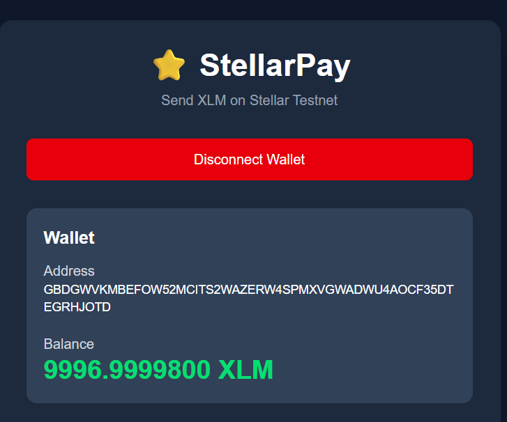
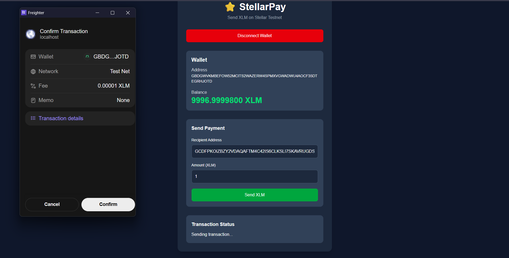
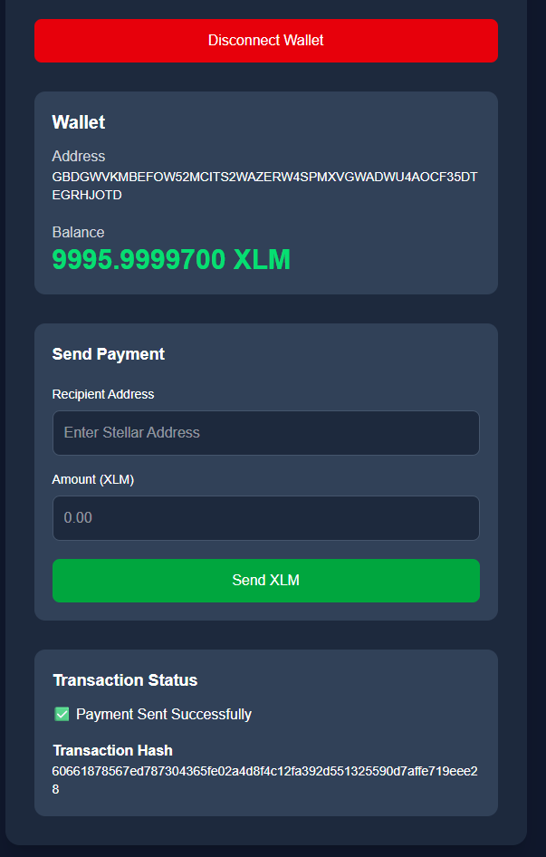

# ⭐ StellarPay

A simple React-based decentralized application (dApp) built on the **Stellar Testnet**.

This project was created as part of the **Stellar Journey to Mastery - White Belt** challenge. It allows users to connect their Freighter wallet, view their XLM balance, and send XLM to another Stellar account on the Testnet.

---

## Features

- Connect Freighter Wallet
- Disconnect Wallet
- View connected wallet address
- Display XLM balance
- Send XLM on Stellar Testnet
- View transaction status
- Display transaction hash after a successful payment

---

## Tech Stack

- React
- Vite
- Tailwind CSS
- Stellar SDK
- Freighter API

---

## Prerequisites

Before running the project, make sure you have:

- Node.js installed
- Freighter Wallet extension installed
- Freighter Wallet connected to **Stellar Testnet**
- A funded Testnet account (using the Stellar Testnet Faucet)

---

## Installation

Clone the repository:

```bash
git clone https://github.com/your-username/stellarpay.git
```

Move into the project directory:

```bash
cd stellarpay
```

Install all dependencies:

```bash
npm install
```

The project uses the following main packages:

```bash
npm install @stellar/stellar-sdk @stellar/freighter-api
```

Start the development server:

```bash
npm run dev
```

Open the application in your browser and connect your Freighter wallet.

---

## Project Screenshots

### Wallet Connected



---

### Sending XLM Transaction



---

### Successful Transaction



---

## Project Structure

```
src/
│
├── components/
├── context/
├── services/
├── App.jsx
├── main.jsx
└── index.css
```

---

## Future Improvements

- Display recent transaction history
- Validate Stellar wallet addresses
- Improve UI responsiveness
- Add loading indicators and better notifications

---

## Author

**Anubhav**

Built for the **Stellar Journey to Mastery - White Belt** challenge.